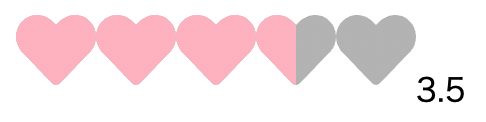
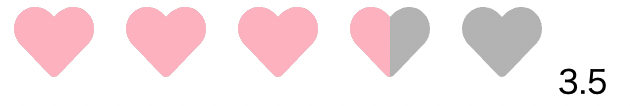

# star-rating-component

React で星型の評価を実装する際、案外便利なライブラリが多くないと思い、ならば自力で実装してみようとこのレポジトリを作ってみました。ライブラリを作成したわけではなく、あくまで星型の評価を実装できるコンポーネントを書いただけですが。こだわった点としては数値の細かな調整が可能という点です。以下のように呼び出します。必須のプロパティ自体はないですが、基本的(後述するrealOnlyプロパティにtrueを渡さない場合)にはonClickプロパティが必要となります。

## 追記
 1. 1/26 にhoverableプロパティを追加し、それにtrue(デフォルトではfalseを渡している)を渡すと、ホバーした際にもアイコンの色が変わるように変更しました。
 2. 1/29 にCustomIconプロパティを追加しました。これにより、デフォルトの星型のアイコンの代わりに、react-iconsから任意のアイコンを表示できるようにしました。
 3. 任意のstyleをアイコンに渡せる様にしました

## 使い方
```
import { useState } from "react";
import StarRating from "./StarRating";
const App = () => {
  const [star, setStar] = useState(0);

  const clickStar = (rate: number) => {
    setStar(rate);
  };


  return (
    <div>
      <StarRating
        onClick={clickStar}
      />

      {/* 下のspanタグの「{star}」は、数値を表示させるために記述 */}
      <span>{star}</span>
    </div>
  );
};

export default App;

```

星型のアイコンをどこの位置でクリックしたかによって、star 変数に特定の数値を渡すことができます。例えば、デフォルトでは星は 5 つ表示されますが、5 つ目の星の中の中央の位置をクリックしたら、以下のようになります。


starRating コンポーネントに渡している incrementPrecision によって数値の細かさを調整することができます。

```
    <StarRating
        onClick={clickStar}

        // ↓のincrementPrecisionに渡している数値によって数値の細かさを調整する
        incrementPrecision={0.5}

        initialRate={1}
    />
```

デフォルトでは 0.5 になっており、この状態では 0.5 刻みの数値(0.5 や 1、1.5 といった数値)を表すことができます。一方で、4.3 や 4.7 といった 0.1 刻みの数値にしたい場合には 0.1 と渡すことで


このように 0.1 刻みの数値を表せます。

逆に、「1」や「2」といった 1 刻みの数値さえ渡すことができればいいという場合には 1 を渡せばいいです。


また、starsNumber というプロパティに 1 以上の数値を渡すことで、星型のアイコンの数を指定された数値分だけ増やしたり、減らしたりすることができます。

```
    <StarRating
        starsNumber={10}
    />
```
と、starsNumberに10を渡せば


上記のように星型のアイコンを10個にすることができます。

他にも、realOnlyやinitailRate、starSize、fillColor、emptyColorといったプロパティを渡すことができ、readOnlyはその名の通り読み取り専用となり、initailRateによって初期値を設定することができます(initailRateはreadOnlyがtrueとなっている際に併用することが多いでしょう)。starSizeに関しては星型のアイコンの大きさ(デフォルトでは40pxとなっています)を、fillColor、emptyColorはそれぞれ星型の色(上記の画像を見るとわかるが、デフォルトではfillColorはyellow、emptyColorはblackとなっている)を決めることができます。

```
import React, { useState, useEffect, useReducer, useMemo, useRef } from "react";
import { calculateRating } from "./utils";
import styles from "./StarRating.module.css";

const StarRating = ({
  starsNumber = 5,
  onClick,
  incrementPrecision = 0.5,
  readonly = false,
  initialRate,
  starSize = 40,
  emptyColor = "silver",
  fillColor = "gold",
  hoverable = false,
  CustomIcon,
  customStyle,
}: {
  starsNumber?: number;
  onClick?: (rate: number) => void;
  incrementPrecision?: 0.1 | 0.5 | 1;
  readonly?: boolean;
  initialRate?: number | undefined;
  starSize?: number;
  emptyColor?: string;
  fillColor?: string;
  hoverable?: boolean;
  CustomIcon?: React.ComponentType<{
    size: number;
    color: string;
    style?: React.CSSProperties;
  }>;
  customStyle?: React.CSSProperties;
}) => {
  const [starRate, setStarRate] = useState<number>(initialRate || 0);
  const [temporaryRate, setTemporaryRate] = useState<number | null>(null);
  const ref = useRef<HTMLDivElement>(null);

  useEffect(() => {
    // starsNumberに渡す数値が0以下だと、そもそも画面に何も表示されなくなる。
    // そのため、starsNumberに渡す数値が0以下の際には、コンソールにエラーを出している
    if (starsNumber <= 0) {
      console.error(
        "starsNumberに無効になる数値が渡されています。1以上の数値を渡してください"
      );
    }

    // 初期値はアイコン(星)の数より大きいということはあり得ないので、その場合の警告を出している
    if (initialRate && initialRate > starsNumber) {
      console.error("初期値は星の数より小さい数値を渡してください");
    }
  }, [starsNumber, initialRate]);

  useEffect(() => {
    // 初期値の値を反映させるために再レンダリングを走らせている
    if (initialRate) {
      setStarRate(initialRate);
      onClick && onClick(initialRate)
    }
  }, [initialRate]);

  const handleClick = (event: React.MouseEvent<HTMLDivElement>) => {
    const { width, left } = ref.current?.getBoundingClientRect()!;
    const x = event.clientX - left;

    const newRate = calculateRating(x, width, starsNumber, incrementPrecision);

    setStarRate(newRate);

    if (onClick) {
      onClick(newRate);
    }
  };

  const handleMouseMove = (event: React.MouseEvent<HTMLDivElement>) => {
    const { width, left } = ref.current?.getBoundingClientRect()!;
    const x = event.clientX - left;

    const newTemporaryRate = calculateRating(
      x,
      width,
      starsNumber,
      incrementPrecision
    );

    setTemporaryRate(newTemporaryRate);
  };

  const handleMouseLeave = () => {
    setTemporaryRate(null);
  };

  const widthPercent = useMemo(() => {
    if (hoverable && temporaryRate !== null) {
      return (temporaryRate / starsNumber) * 100 + "%";
    } else {
      return (starRate / starsNumber) * 100 + "%";
    }
  }, [starRate, starsNumber, temporaryRate]);

  return (
    <>
      <div
        ref={ref}
        onClick={readonly ? undefined : handleClick}
        onMouseMove={readonly || !hoverable ? undefined : handleMouseMove}
        onMouseLeave={readonly || !hoverable ? undefined : handleMouseLeave}
        className={styles.wrapper}
        style={readonly ? { cursor: "default" } : { cursor: "pointer" }}
      >
        <span>
          {[...Array(starsNumber)].map((_) => (
            <>
              {CustomIcon ? (
                <CustomIcon
                  size={starSize}
                  color={emptyColor}
                  style={customStyle}
                />
              ) : (
                <svg
                  xmlns="http://www.w3.org/2000/svg"
                  viewBox="-100 -100 200 200"
                  width={starSize}
                  height={starSize}
                  fill={emptyColor}
                  style={customStyle}
                >
                  <polygon points="0,-100 29.39,-40.45 95.11,-30.9 47.55,15.45 58.78,80.90 0,50 -58.78,80.9 -47.55,15.45 -95.11,-30.9 -29.39,-40.45" />
                </svg>
              )}
            </>
          ))}
        </span>

        <span
          className={styles.fillIcons}
          style={{
            width: widthPercent,
          }}
        >
          {[...Array(starsNumber)].map((_) => (
            <>
              {CustomIcon ? (
                <CustomIcon
                  size={starSize}
                  color={fillColor}
                  style={customStyle}
                />
              ) : (
                <svg
                  xmlns="http://www.w3.org/2000/svg"
                  viewBox="-100 -100 200 200"
                  width={starSize}
                  height={starSize}
                  fill={fillColor}
                  style={customStyle}
                >
                  <polygon points="0,-100 29.39,-40.45 95.11,-30.9 47.55,15.45 58.78,80.90 0,50 -58.78,80.9 -47.55,15.45 -95.11,-30.9 -29.39,-40.45" />
                </svg>
              )}
            </>
          ))}
        </span>
      </div>
    </>
  );
};

export default StarRating;
```


## CustomIconプロパティについて
デフォルトでは星型のアイコンだけしか使えませんでしたが、CustomIconプロパティにreact-iconsの任意の画像を渡すことで、星型のアイコン以外も表示できるようにしました。試しに、react-iconsのハートの画像を星型のアイコンの代わりに表示させたいとしたら以下のように書けます。

```
import { useState } from "react";
import StarRating from "./StarRating";
// reat-iconsから下記のようにハートの画像をimportする
import { FaHeart } from "react-icons/fa";

const App = () => {
  const [heart, setHeart] = useState(0);

  const clickHeart = (rate: number) => {
    setHeart(rate);
  };


  return (
    <div>
      <StarRating
        onClick={clickHeart}
        CustomIcon={FaHeart}
        fillColor="pink"
      />

      {/* 下のspanタグの「{star}」は、数値を表示させるために記述 */}
      <span>{heart}</span>
    </div>
  );
};

export default App;
```

以下が上記のコードの出力画面です。(fillColorプロパティに"pink"を渡すことで、画像の色は変更できます。)



## customStyleプロパティについて

このプロパティは任意のstyleを渡せる様にしたものです。例えば、下記のようにcustomStyleプロパティを渡すことでアイコンとアイコンの間にmarginを設定することができます。渡し方としては、inline-styleと同じように書けば動作します。

```
const App = () => {
  const [heart, setHeart] = useState(0);

  const clickHeart = (rate: number) => {
    setHeart(rate);
  };


  return (
    <div>
      <StarRating
        onClick={clickHeart}
        CustomIcon={FaHeart}
        fillColor="pink"
        // 左右のmarginを設定する場合のコード
        customStyle={{margin: "0 8px"}}
      />
      {/* 下のspanタグの「{star}」は、数値を表示させるために記述 */}
      <span>{heart}</span>
    </div>
  );
};

export default App;
```

このように書くことで下記のようにmarginが設定できる。一個上のすぐの画像と比べると、左右に隙間が広がっていることがわかると思います。上記の例ではCustomIconにcustomStyleを渡していますが、デフォルトの星型のアイコンにもcustomStyleを渡せます。

