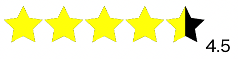
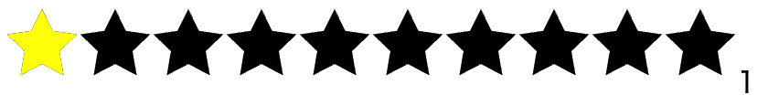

# star-rating-component

React で星型の評価を実装する際、案外便利なライブラリが多くないと思い、ならば自力で実装してみようとこのレポジトリを作ってみました。ライブラリを作成したわけではなく、あくまで星型の評価を実装できるコンポーネントを書いただけですが。こだわった点としては数値の細かな調整が可能という点です。以下のように呼び出します。必須のプロパティ自体はないですが、基本的(後述するrealOnlyプロパティにtrueを渡さない場合)にはonClickプロパティが必要となります。

```
import { useState } from "react";
import StarRating from "./StarRating";
const App = () => {
  const [star, setStar] = useState(0);

  const clickStar = (rate: number) => {
    setStar(rate);
  };


  return (
    <div>
      <StarRating
        onClick={clickStar}
      />

      {/* 下のspanタグの「{star}」は、数値を表示させるために記述 */}
      <span>{star}</span>
    </div>
  );
};

export default App;

```

星型のアイコンをどこの位置でクリックしたかによって、star 変数に特定の数値を渡すことができます。例えば、デフォルトでは星は 5 つ表示されますが、5 つ目の星の中の中央の位置をクリックしたら、以下のようになります。



starRating コンポーネントに渡している incrementPrecision によって数値の細かさを調整することができます。

```
    <StarRating
        onClick={clickStar}

        // ↓のincrementPrecisionに渡している数値によって数値の細かさを調整する
        incrementPrecision={0.5}

        initialRate={1}
    />
```

デフォルトでは 0.5 になっており、この状態では 0.5 刻みの数値(0.5 や 1、1.5 といった数値)を表すことができます。一方で、4.3 や 4.7 といった 0.1 刻みの数値にしたい場合には 0.1 と渡すことで


このように 0.1 刻みの数値を表せます。

逆に、「1」や「2」といった 1 刻みの数値さえ渡すことができればいいという場合には 1 を渡せばいいです。


また、starsNumber というプロパティに 1 以上の数値を渡すことで、星型のアイコンの数を指定された数値分だけ増やしたり、減らしたりすることができます。

```
    <StarRating
        starsNumber={10}
    />
```
と、starsNumberに10を渡せば



上記のように星型のアイコンを10個にすることができます。

他にも、realOnlyやinitailRate、starSize、fillColor、emptyColorといったプロパティを渡すことができ、readOnlyはその名の通り読み取り専用となり、initailRateによって初期値を設定することができます(initailRateはreadOnlyがtrueとなっている際に併用することが多いでしょう)。starSizeに関しては星型のアイコンの大きさ(デフォルトでは40pxとなっています)を、fillColor、emptyColorはそれぞれ星型の色(上記の画像を見るとわかるが、デフォルトではfillColorはyellow、emptyColorはblackとなっている)を決めることができます。

```
import { useRef, useReducer, useMemo, useEffect } from "react";
import styles from "./StarRating.module.css";

const StarRating = ({
  starsNumber = 5,
  onClick,
  incrementPrecision = 0.5,
  readonly = false,
  initialRate,
  starSize = 40,
  emptyColor = "black",
  fillColor = "yellow",
}: {
  starsNumber?: number;
  onClick?: (rate: number) => void;
  incrementPrecision?: 0.1 | 0.5 | 1;
  readonly?: boolean;
  initialRate?: number | undefined;
  starSize?: number;
  emptyColor?: string;
  fillColor?: string;
}) => {
  const starRef = useRef<number>(initialRate ? initialRate : 0);
  const forceUpdate = useReducer(() => ({}), {})[1];
  const ref = useRef<HTMLDivElement>(null);

  useEffect(() => {
    // starsNumberに渡す数値が0以下だと、そもそも画面に何も表示されなくなる。
    // そのため、starsNumberに渡す数値が0以下の際には、コンソールにエラーを出している
    if (starsNumber <= 0) {
      console.error(
        "starsNumberに無効になる数値が渡されています。1以上の数値を渡してください"
      );
    }

    // 初期値の値を反映させるために再レンダリングを走らせている
    if (initialRate) {
      starRef.current = initialRate;
      onClick ? onClick(starRef.current) : forceUpdate();
    }

    // 初期値はアイコン(星)の数より大きいということはあり得ないので、その場合の警告を出している
    if (initialRate && initialRate > starsNumber) {
      console.error("初期値は星の数より小さい数値を渡してください");
    }
  }, [starsNumber, initialRate]);

  const handleClick = (event: React.MouseEvent<HTMLDivElement>) => {
    const { width, left } = ref.current?.getBoundingClientRect()!;

    const x = event.clientX - left;

    // 以下の条件文は細かさの調整をしている
    // 0.5の場合は0.5刻みの数値(「1.5」、「2.0」、「2.5」といった数値)
    // 1の場合は1刻みの数値(「1」、「2」、「3」といった数値)
    // 0.1の場合は0.1刻みの数値(「1.1」、「1.3」、「1.4」といった数値)に調整できる
    if (incrementPrecision === 0.5) {
      starRef.current = Math.round((x / width) * starsNumber * 2) / 2;
    } else if (incrementPrecision === 1) {
      starRef.current = Math.round((x / width) * starsNumber);
    } else if (incrementPrecision === 0.1) {
      starRef.current = Math.round((x / width) * starsNumber * 10) / 10;
    }

    debugger

    // 以下は再レンダリングを走らせるための処理
    if (onClick) {
      onClick(starRef.current);
    } else {
      forceUpdate();
    }
  };

  const widthPercent = useMemo(() => {
    return (starRef.current / starsNumber) * 100 + "%";
  }, [starRef.current, starsNumber]);

  return (
    <>
      <div
        ref={ref}
        onClick={readonly ? undefined : handleClick}
        className={styles.star}
      >
        <span>
          {[...Array(starsNumber)].map((_, index) => (
            <svg
              key={index}
              xmlns="http://www.w3.org/2000/svg"
              viewBox="-100 -100 200 200"
              width={starSize}
              height={starSize}
              fill={emptyColor}
            >
              <polygon points="0,-100 29.39,-40.45 95.11,-30.9 47.55,15.45 58.78,80.90 0,50 -58.78,80.9 -47.55,15.45 -95.11,-30.9 -29.39,-40.45" />
            </svg>
          ))}
        </span>

        <span
          className={styles.fullIcons}
          style={{
            width: widthPercent,
          }}
        >
          {[...Array(starsNumber)].map((_, index) => (
            <svg
              key={index}
              xmlns="http://www.w3.org/2000/svg"
              viewBox="-100 -100 200 200"
              width={starSize}
              height={starSize}
              fill={fillColor}
            >
              <polygon points="0,-100 29.39,-40.45 95.11,-30.9 47.55,15.45 58.78,80.90 0,50 -58.78,80.9 -47.55,15.45 -95.11,-30.9 -29.39,-40.45" />
            </svg>
          ))}
        </span>
      </div>
    </>
  );
};

export default StarRating;
```
